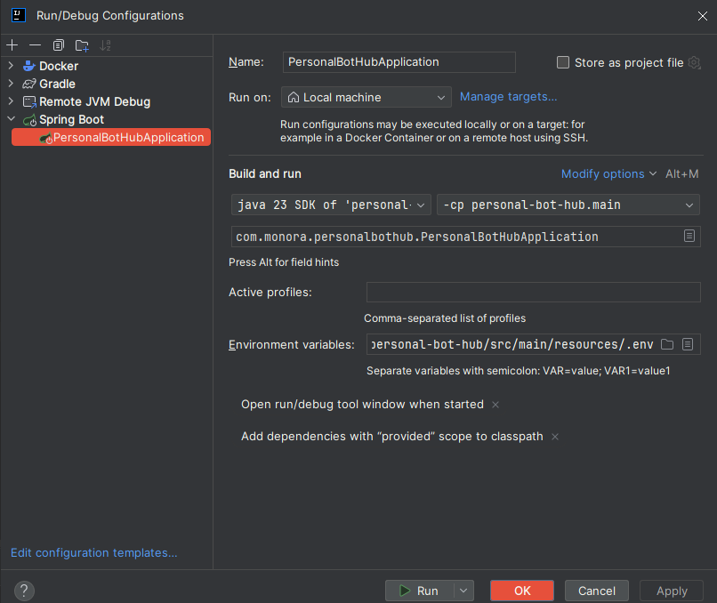

# PersonalBotHub

PersonalBotHub is a REST API for creating and managing Telegram bots. The project provides a convenient constructor that allows you to quickly develop and customize bot functionality without requiring deep programming knowledge.

### Core Technologies:
**Spring Boot:** The main framework for REST API development.

**PostgreSQL:** A relational database for storing information about bots, users, and their data.

**Docker:** Application containerization for easy deployment and scaling.

**Pengrad Telegram API:** A library for interacting with the Telegram Bot API.

### Key Features:
Bot Creation and Configuration:

- Manage bot commands.
- Customize message responses.
- Integrate with external APIs.

### User Management:

- Store user data.
- Send personalized messages.

### Telegram Integration:
- Support for all core Telegram Bot API features.
- Processing incoming messages and events.

1. Create .env:
2. Add line
- TELEGRAM_BOT_TOKEN=31412125:dfsfdlkj
3. Connect in IDEA

